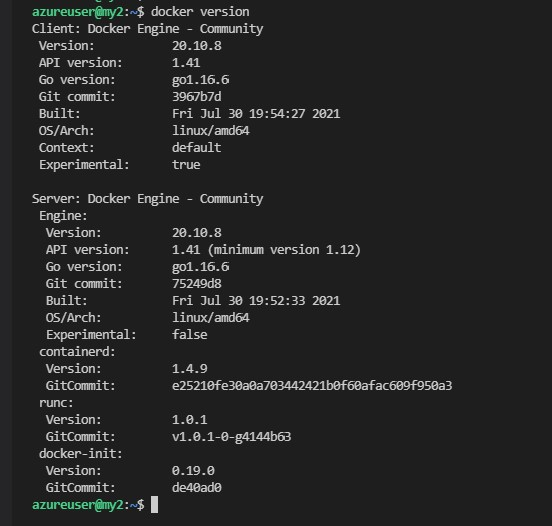
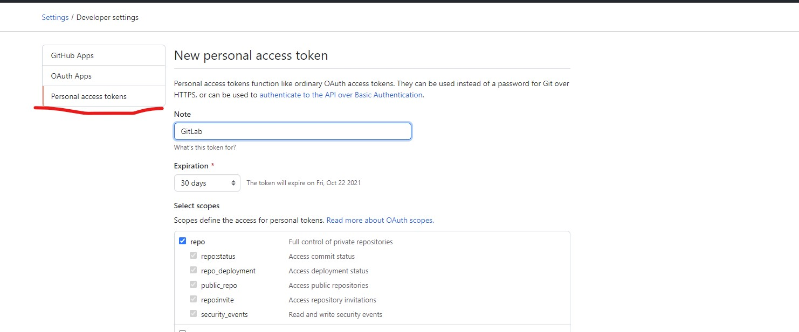
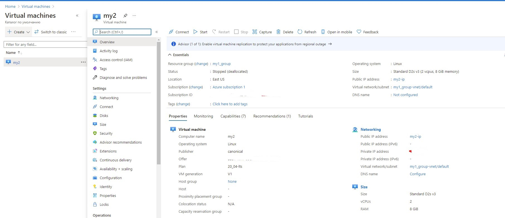
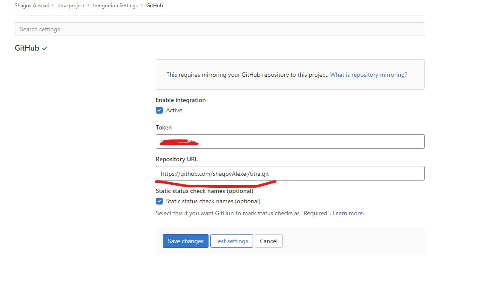

# Task 8: K8s, Clouds, CI/CD. Just do it!
Important points:

1. After the completion of development you will show a presentation of the project (Share screen + documentation).

Tasks:
1. Select an application from the list  (pay attention to the date of the last change in the project ): https://github.com/unicodeveloper/awesome-opensource-apps
2. Select an CI/CD. You can choose any option, but we recommend looking here: 
https://pages.awscloud.com/awsmp-wsm-dev-workshop-series-module3-evolving-to-continuous-deployment-ty.html
3. Select Cloud Service provider for your infrastructure.

What would we like to see? The created infrastructure in which it will be possible to build, deploy and test the application.  

The main things to look out for 
- Git integration;
- Setup/configure CI/CD;
- Application/s should be containerized;
- Scheduled backups for DB and all critical data;
- Logging and monitoring for your services;
- Security;
- Use Kubernetes as an orchestration (cloud provider is recommended);
- The project must be documented, step-by-step guides to deploy from scratch; 
EXTRA: SonarQube integration.

  

#  Exadel Internship project KroKusLab

Content:

[Integration Github with GitLab.](#github_integration)

[Run GitLlab Runners.](#runners)

[Run GitLlab Runners.](#runners)

[Run GitLlab Runners.](#runners)

[Run GitLlab Runners.](#runners)

...

---
Made a branch from the official repository  [Titra](https://github.com/kromitgmbh/titra) and configured web hook for integration with [GitLab repository of our project ](https://gitlab.com/shagov.alexei/titra-project).

Create personal access token

In GitLab, create a project and setup

Select a project and import it

