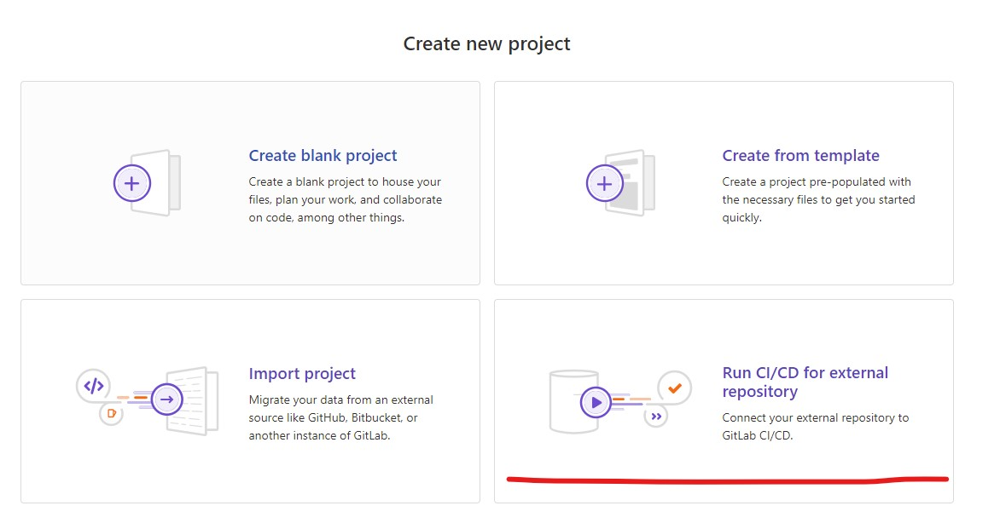
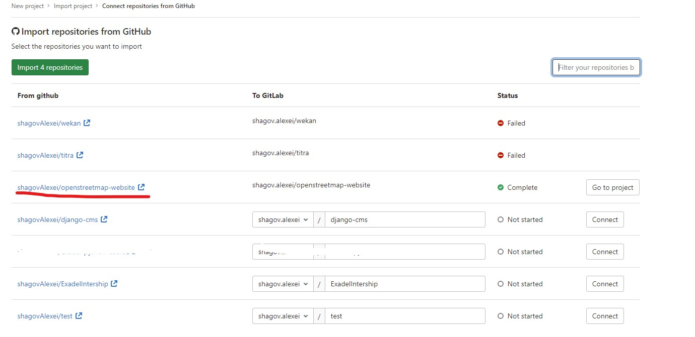
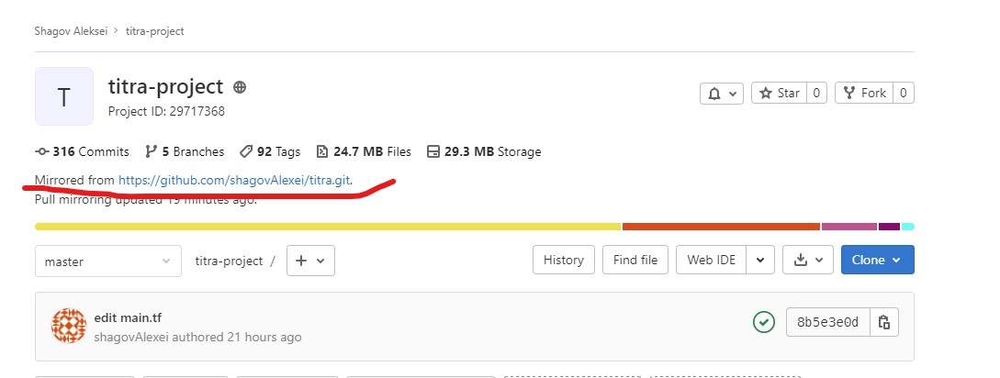
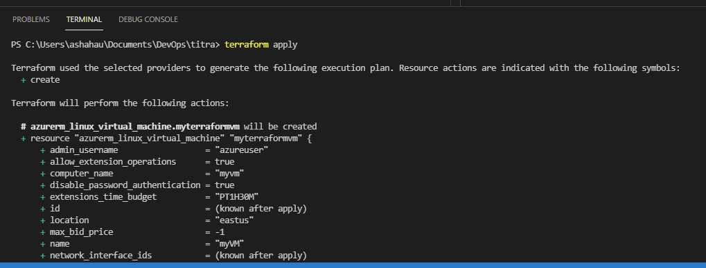
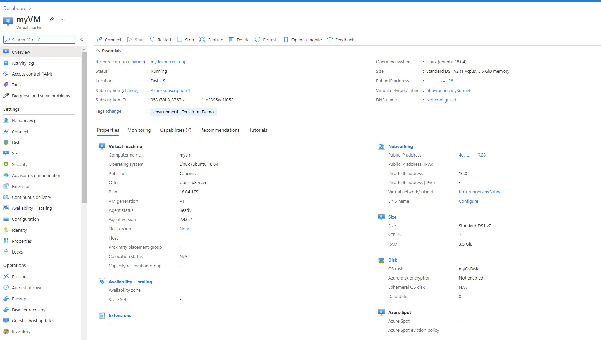
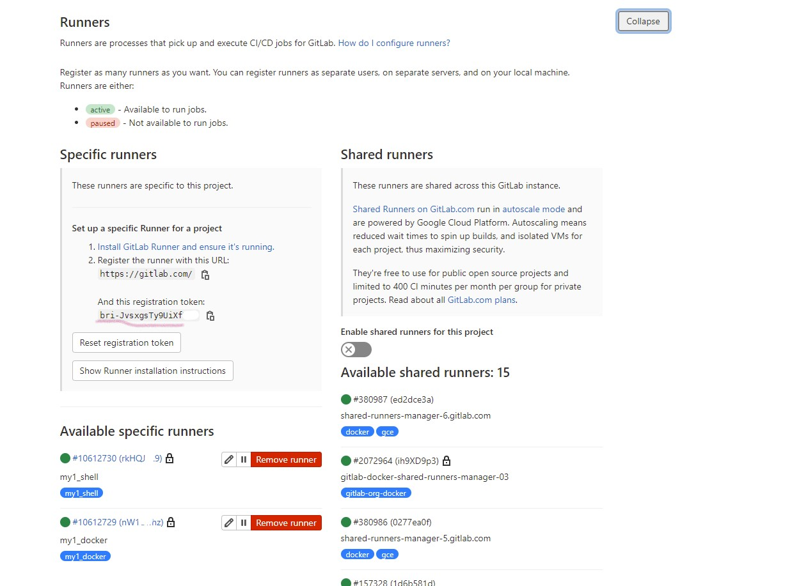
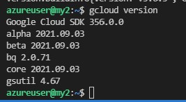

[](https://github.com/kromitgmbh/titra/actions/workflows/push.yml)  

#  Exadel Internship project KroKusLab

Content:

[1. Integration Github with GitLab](#github_integration)

[2. Create Microsoft Azure VM](#vm)

[3. Install Docker](#docker)

[4. Install and setup gitlab-runner](#runners)

[5. Install and setup kubectl](#kubectl)

[6. Install and setup Google Cloud SDK](#gcloud)

[7. Install and setup Helm](#helm)
...

---
<a name="github_integration"></a><!-- 1 -->
## Made a branch from the official repository  [Titra](https://github.com/kromitgmbh/titra) and configured web hook for integration with [GitLab repository of our project ](https://gitlab.com/shagov.alexei/titra-project).


Create personal access token


In GitLab, create a project, import and setup





---
<a name="vm"></a> <!-- 2 -->
## Created for the build, testing and deployment stages VM in Microsoft Azure
### 1. Manual


### 2. Using Terraform 
### [Terraform file link](https://gitlab.com/shagov.alexei/titra-project/-/blob/master/main.tf)

```sh
$env:ARM_SUBSCRIPTION_ID="xxx"
$env:ARM_TENANT_ID="xxx"
$env:ARM_CLIENT_ID="xxx"
$env:ARM_CLIENT_SECRET="xxx"

echo $env:ARM_SUBSCRIPTION_ID
echo $env:ARM_TENANT_ID
echo $env:ARM_CLIENT_ID
echo $env:ARM_CLIENT_SECRET
```





---
<a name="docker"></a><!-- 3 -->
### Install docker 

```sh
sudo apt update -y

sudo apt-get install \
    apt-transport-https \
    ca-certificates \
    curl \
    gnupg \
    lsb-release
   
curl -fsSL https://download.docker.com/linux/ubuntu/gpg | sudo gpg --dearmor -o /usr/share/keyrings/docker-archive-keyring.gpg

echo \
  "deb [arch=amd64 signed-by=/usr/share/keyrings/docker-archive-keyring.gpg] https://download.docker.com/linux/ubuntu \
  $(lsb_release -cs) stable" | sudo tee /etc/apt/sources.list.d/docker.list > /dev/null

sudo apt update -y && sudo apt-get install docker-ce docker-ce-cli containerd.io -y
```

---
<a name="runner"></a><!-- 4 -->
### Install and setup gitlab-runner 


```sh
curl -LJO "https://gitlab-runner-downloads.s3.amazonaws.com/latest/deb/gitlab-runner_amd64.deb"
sudo dpkg -i gitlab-runner_amd64.deb
gitlab-runner -v
sudo usermod -aG docker gitlab-runner
sudo gitlab-runner register

# register setup
sudo gitlab-runner register -n \
  --url https://gitlab.com/ \
  --registration-token bri-JvsxgsTy...... \
  --executor docker \
  --description 'my1_docker' \
  --docker-image "docker" \
  --docker-privileged=true \
  --tag-list "my1_docker" \
  --docker-volumes '/cache' \
  --docker-volumes '/var/run/docker.sock:/var/run/docker.sock' 

sudo gitlab-runner register -n \
  --url https://gitlab.com/ \
  --registration-token bri-JvsxgsT...... \
  --executor shell \
  --tag-list "my1_shell" \
  --description "my1_shell" 


sudo gitlab-runner list
sudo gitlab-runner unregister --name my1_docker
sudo gitlab-runner unregister --name my1_shell

sudo cat /etc/gitlab-runner/config.toml
```


---
<a name="kubectl"></a><!-- 5 -->
### Install and setup kubectl

```sh
curl -LO https://storage.googleapis.com/kubernetes-release/release/`curl -s https://storage.googleapis.com/kubernetes-release/release/stable.txt`/bin/linux/amd64/kubectl

chmod +x ./kubectl

sudo mv ./kubectl /usr/local/bin/kubectl

kubectl version --client
```

---
<a name="gcloud"></a><!-- 6 -->
### Install and setup Google Cloud SDK

 ```sh
  echo "deb [signed-by=/usr/share/keyrings/cloud.google.gpg] https://packages.cloud.google.com/apt cloud-sdk main" | sudo tee -a /etc/apt/sources.list.d/google-cloud-sdk.list
 
 sudo apt-get install apt-transport-https ca-certificates gnupg
 
 curl https://packages.cloud.google.com/apt/doc/apt-key.gpg | sudo apt-key --keyring /usr/share/keyrings/cloud.google.gpg add -

 sudo apt-get update -y
 
 sudo apt-get install google-cloud-sdk -y 
 
 gcloud version
```



---
<a name="helm"></a><!-- 7 -->
### Install and setup Helm 

```sh
curl -fsSL -o get_helm.sh https://raw.githubusercontent.com/helm/helm/master/scripts/get-helm-3

chmod 700 get_helm.sh

./get_helm.sh

helm version
```


